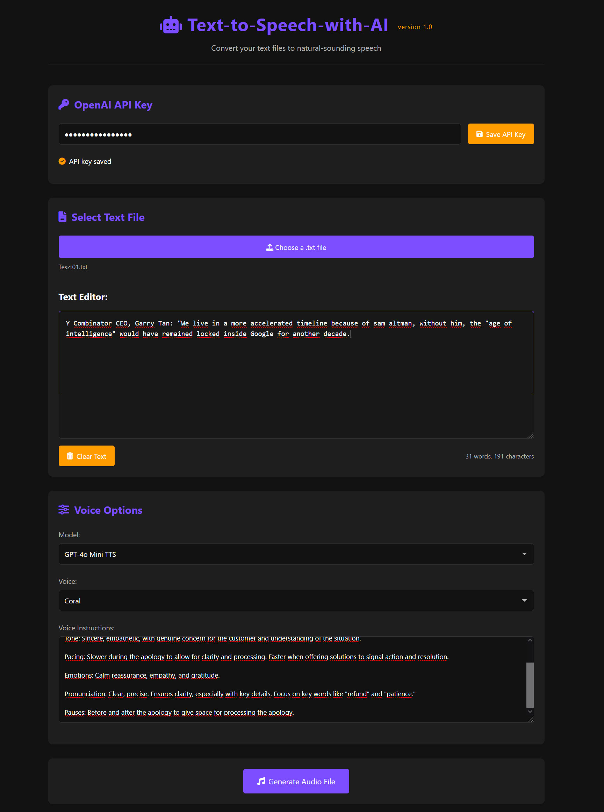

# Text-to-Speech Converter


A modern, dark-themed, responsive web application that converts text to natural-sounding speech using OpenAI's Text-to-Speech API.



## Features

- **Modern Dark UI**: Sleek, responsive design that works on desktop and mobile devices
- **Text Input Options**:
  - Load text from a .txt file
  - Directly type or paste text into the editor
  - Edit loaded text before conversion
- **Voice Customization**:
  - Select from different TTS models (GPT-4o Mini TTS, TTS-1, TTS-1-HD)
  - Choose from various voice options (Alloy, Echo, Fable, Onyx, Nova, Shimmer, Coral)
  - Customize voice instructions for models that support it
- **User-Friendly Features**:
  - Real-time word and character count
  - Text preview with editing capabilities
  - One-click text clearing
  - Secure API key storage in browser localStorage
- **Helpful Notifications**:
  - Toast notifications for quick feedback
  - Modal dialogs for important messages and errors

## Getting Started

### Prerequisites

- A modern web browser (Chrome, Firefox, Edge, Safari)
- An OpenAI API key with access to the Text-to-Speech API

### Installation

1. Clone or download this repository to your local machine
2. Open the `index.html` file in your web browser
3. No server setup or dependencies required!

### Usage

1. **Set Up Your API Key**:
   - Enter your OpenAI API key in the designated field at the top of the page
   - Click "Save API Key" to securely store it in your browser's localStorage
   - Your API key will be masked for security after saving

2. **Input Text**:
   - Option 1: Click "Choose a .txt file" to load text from a file on your computer
   - Option 2: Type or paste text directly into the text editor
   - Edit the text as needed before generating audio

3. **Customize Voice Settings**:
   - Select a TTS model from the dropdown menu
   - Choose a voice that matches your desired style
   - Customize voice instructions for supported models (like GPT-4o Mini TTS)

4. **Generate Audio**:
   - Click the "Generate Audio File" button
   - Wait for the API to process your request (a loading spinner will appear)
   - The generated MP3 file will automatically download to your computer

5. **Additional Features**:
   - Use the "Clear Text" button to quickly remove all text from the editor
   - View real-time word and character count below the text editor
   - Resize the text editor by dragging the bottom-right corner

## API Usage

This application uses the OpenAI Text-to-Speech API to convert text to speech. The API call is made directly from the browser using the following endpoint:

```
https://api.openai.com/v1/audio/speech
```

The API request includes:
- Your OpenAI API key (stored securely in localStorage)
- The selected TTS model
- The selected voice
- The text input from the editor
- Optional voice instructions (for supported models)

For more information about the OpenAI Text-to-Speech API, visit: [OpenAI TTS Documentation](https://platform.openai.com/docs/guides/text-to-speech)

## Security Considerations

- Your API key is stored in your browser's localStorage and never sent to any server other than OpenAI
- The API key is masked in the UI after saving for additional security
- All processing happens in your browser - no text data is stored on any external servers

## Browser Compatibility

The application is compatible with all modern browsers:
- Google Chrome (recommended)
- Mozilla Firefox
- Microsoft Edge
- Safari
- Opera

## Limitations

- The OpenAI API has rate limits and usage costs - check OpenAI's pricing page for details
- Very long texts may be truncated by the API - consider splitting into smaller chunks
- API key is stored in localStorage, which is browser-specific and will not sync across devices

## Troubleshooting

**Issue**: Audio generation fails with an error
- Verify your API key is correct and has access to the Text-to-Speech API
- Check if you've exceeded your API usage limits
- Ensure your text isn't too long for the API to process

**Issue**: Text file doesn't load properly
- Ensure the file is a valid .txt file with proper encoding (UTF-8 recommended)
- Try copying the text and pasting it directly into the editor

**Issue**: API key not saving
- Make sure cookies and localStorage are enabled in your browser
- Try using a private/incognito window if you're on a shared computer

## License

This project is available for personal and commercial use.

## Acknowledgments

- Uses the OpenAI API for text-to-speech conversion
- Built with vanilla HTML, CSS, and JavaScript
- Icons provided by Font Awesome
